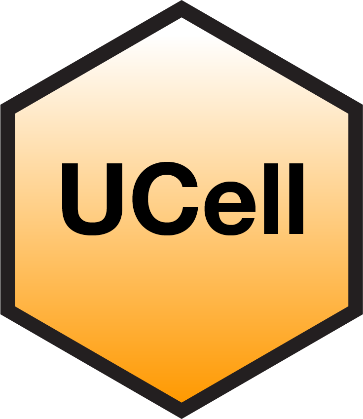

# UCell: Robust and scalable single-cell gene signature scoring

<p align="center">
  
</p>

`UCell` is an R package for scoring gene signatures in single-cell datasets. UCell scores, based on the Mann-Whitney U statistic, are robust to dataset size and heterogeneity, and their calculation demands relatively less computing time and memory than other robust methods, enabling the processing of large datasets (>10^5 cells). UCell can be applied to any cell vs. gene data matrix, and includes functions to directly interact with Seurat and Bioconductor's SingleCellExperiment objects. 

Find the installation instructions for the package and usage vignettes below.

### Package Installation

**[UCell is on Bioconductor](https://bioconductor.org/packages/release/bioc/html/UCell.html)** To install the package from Bioc run:
```r
if (!requireNamespace("BiocManager", quietly=TRUE))
    install.packages("BiocManager")
BiocManager::install("UCell")
```

For previous releases of `UCell`, you may download a tagged version from GitHub:
```r
library(remotes)
remotes::install_github("carmonalab/UCell", ref="v2.2")
```


### Test the package

Load sample data and test your installation:
```r
library(UCell)

data(sample.matrix)
gene.sets <- list(Tcell_signature = c("CD2","CD3E","CD3D"),
			Myeloid_signature = c("SPI1","FCER1G","CSF1R"))

scores <- ScoreSignatures_UCell(sample.matrix, features=gene.sets)
head(scores)
```

### Vignettes and examples

Vignettes to run UCell on matrices, SingleCellExperiment or Seurat objects can be found at the [UCell Bioc page](https://bioconductor.org/packages/release/bioc/html/UCell.html).

Extended tutorial are also available at:

* [Single-cell gene signature scoring with UCell](https://carmonalab.github.io/UCell_demo/UCell_matrix_vignette.html)

* [Using UCell with Seurat objects](https://carmonalab.github.io/UCell_demo/UCell_Seurat_vignette.html)

* [Using UCell and Seurat to identify different T cell subtypes/states in human tumors](https://carmonalab.github.io/UCell_demo/UCell_vignette_TILstates.html)

### New in version >= 2.7.6

Calculation of UCell scores has been updated as follows:

${UCell} = 1 - {U} / {U_{max}}$

where

$U = \sum_{i} r_{i} - s_{min}$

$U_{max} = s_{max} - s_{min}$

$s_{max} = n * {maxRank}$

$s_{min} = n(n+1) / 2$

$n$ is the number of genes in the signature, ${maxRank}$ is a parameter limiting the ranking to the top genes, and U is the Mann-Whitney U statistic (bounded by 0 and $U_{max}$). Earlier implementations used $U_{max} = s_{max}$ to normalize the U statistics. While for typical applications results should be similar between the two implementations, the new normalization provides more homogeneous UCell score distributions for large gene sets.

### New in version >= 2.1.2

Single-cell data are sparse. It can be useful to 'impute' scores by neighboring cells and partially correct this sparsity. The new function `SmoothKNN` performs smoothing of single-cell signature scores by weighted average of the k-nearest neighbors in a given dimensionality reduction. It can be applied directly on SingleCellExperiment or Seurat objects to smooth UCell scores:

```r
obj <- SmoothKNN(obj, signature.names = sigs, reduction="pca")
```

### Interacting with signatures

For easy retrieval and storing of signatures, check out [SignatuR](https://github.com/carmonalab/SignatuR):

```r
remotes::install_github("carmonalab/SignatuR")
library(SignatuR)
#e.g. get a cycling signature
cycling.G1S <- GetSignature(SignatuR$Hs$Programs$cellCycle.G1S)
```

### Get help

See more information about UCell and its functions by typing `?UCell` within R. Please address your questions and bug reports at: [UCell issues](https://github.com/carmonalab/UCell/issues).

### Citation

UCell: robust and scalable single-cell gene signature scoring. Massimo Andreatta & Santiago J Carmona **(2021)** *CSBJ* https://doi.org/10.1016/j.csbj.2021.06.043

<p align="center">
  
</p>
